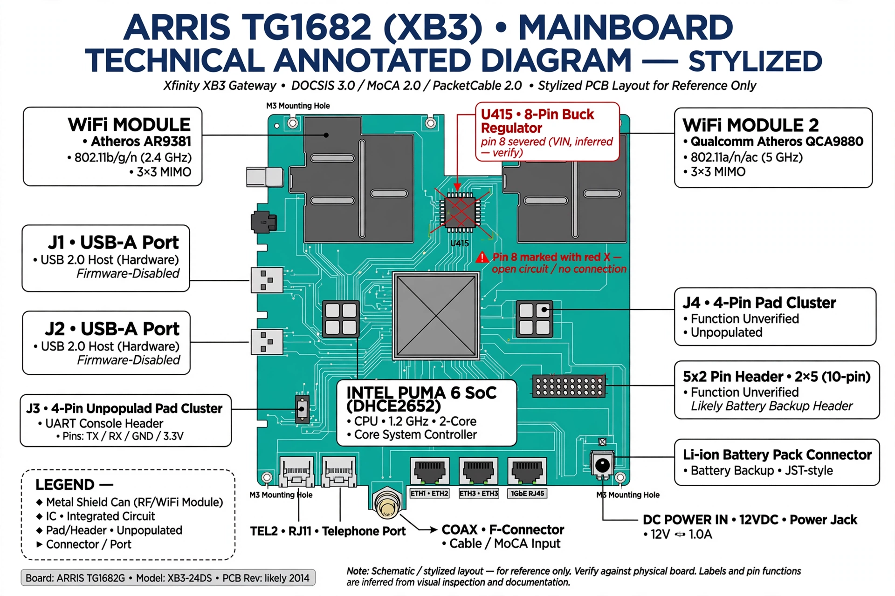

# XB3 — ARRIS TG1682 Board-Level Hardware Notes

Board-level analysis of the Xfinity XB3 gateway (ARRIS TG1682, Intel Puma 6
SoC). The work covers identifying the board's debug interfaces at the hardware
level, capturing the UART boot log, and a physical board modification to take
bridge-mode control from ISP firmware on owned hardware.

> Personal research on owned hardware (pre-paid unit, no lease). Read-only,
> defensive posture. See REVIEW.md for corrections and open questions.

## Device



*Stylized layout — verify against the physical board. See REVIEW.md for
diagram accuracy notes.*

| Item | Value |
|---|---|
| Model | ARRIS TG1682 (XB3), board labeled TG1682/TG2472 |
| SoC | Intel Puma 6 (DHCE2652), dual-core 1.2 GHz (ARM) |
| Boot ROM | "Cat Mountain D0" v0.1.16 |
| Bootloader | U-Boot 1.2.0 / PSPU-Boot 4.2.0.45 |
| Kernel | Linux 3.12.14 (built 2020-07-24), BusyBox v1.22.1 |
| DRAM | 256 MB |
| Flash | eMMC 231 MB ("MMC256"), board type `harborpark-mg` |

## Timeline

- **2025-07-24 → 2025-07-26** — USB-C/micro-USB cable pinout research (multimeter +
  Glasgow); Glasgow logic-analyzer bring-up
- **2026-03-31** — bridge-mode hardware-hack investigation
- **2026-04-04** — USB-A port (J1/J2) documentation dragnet; J3 UART boot log captured
- **2026-04-13** — U415 pin-8 mod performed (WiFi radios killed); bridge-mode setup
  with AirPort Time Capsule 6th gen as router
- **2026-06-30** — post-mod security review

## Key findings

1. **J1/J2 (USB-A ports)** — Official docs claim USB 2.0 host ("future support for
   external USB devices"). In practice the USB stack never initializes (see
   `docs/usb-ports-analysis.md`). True electrical function still unverified; JTAG
   is the working hypothesis, unproven.
2. **J3 (4-pin pads, near SoC)** — UART console, captured at 3.3 V via Glasgow
   (`docs/uart-bootlog.md`). Full boot log from Boot ROM through Linux init.
3. **U415 mod** — Severing pin 8 on U415 (8-pin buck regulator feeding the WiFi
   modules, consistent with TI TPS54328) kills the 2.4/5 GHz radios. Verified:
   WiFi LEDs off, wired Ethernet unaffected (`docs/u415-mod.md`).
4. **Cable pinouts** — Full continuity + voltage tables for a locked-down
   micro-USB↔USB-C cable (`docs/pinouts.md`).

## File guide

```
README.md                  this file
REVIEW.md                  technical review: corrections, flags, open questions
docs/usb-ports-analysis.md J1/J2 documentation dragnet and conclusions
docs/u415-mod.md           pin-8 mod procedure, purpose, warnings
docs/uart-bootlog.md       J3 UART capture notes and annotated boot log
docs/pinouts.md            multimeter continuity/voltage tables
docs/glossary.md           JTAG/UART/Puma 6 terminology
docs/images/               diagrams (board, signals, mod, pinouts, boot, network)
```

## References

- pmarks-net, "Xfinity XB3 hardware mod: Disable WiFi and save 2 watts" —
  https://gist.github.com/pmarks-net/af40dba69272806c1ec9cbe71429d2e7
- Glasgow Digital Interface Explorer — https://glasgow-embedded.org/
