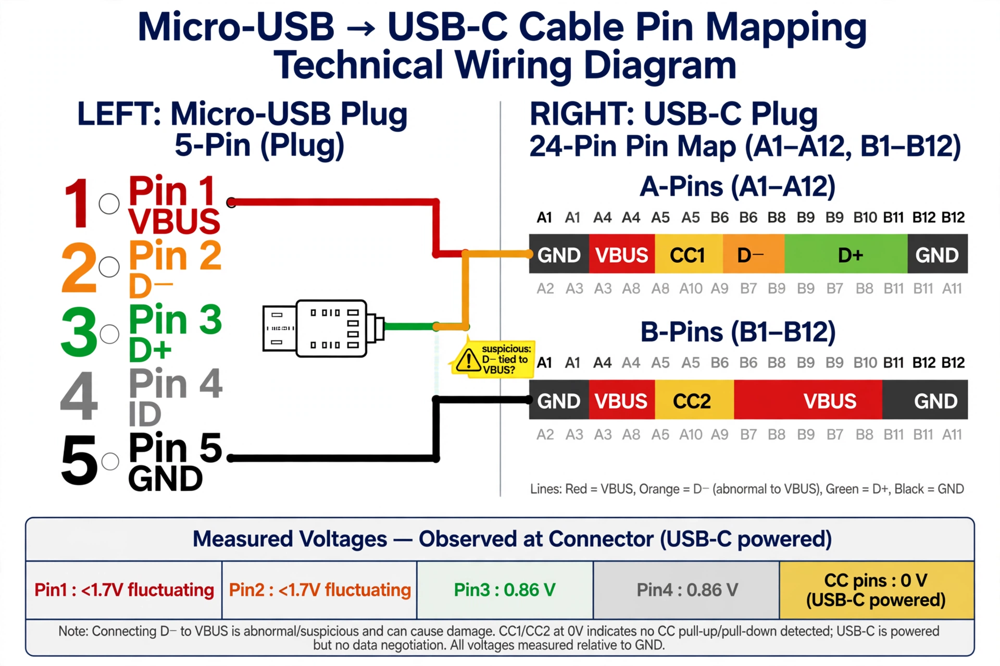

# Pinout Tables — Micro-USB ↔ USB-C "Security" Cable

Target: a factory Apple Store "security cable" (micro-USB to USB-C), probed with
a Fluke 27 multimeter and female breakout boards on both ends. The cable is
"locked down" — see the anomalies below.

## Continuity (unpowered)

| Micro-USB pin | Name | USB-C connection |
|---|---|---|
| 1 | VBUS | A4/B4/A9/B9 (any VBUS) |
| 2 | D- | A4/B4/A9/B9 ⚠️ |
| 3 | D+ | A7 |
| 4 | ID | (not mapped in continuity pass) |
| 5 | GND | A1/B1/A12/B12 |

⚠️ **Micro-USB pin 2 (D-) shows continuity to the VBUS group (A4/B4/A9/B9),
not to a D- pin (A6).** Either the cable is damaged/miswired or a probe
slipped during measurement. Treat as suspect — see REVIEW.md.

## Voltages (USB-C end powered)

| Micro-USB pin | Reading |
|---|---|
| Pin 1 | < 1.7 V, fluctuating |
| Pin 2 | < 1.7 V, fluctuating |
| Pin 3 | 0.86 V |
| Pin 4 | 0.86 V |
| CC pins (A5/B5) | 0 V |

## Reading the results

- **VBUS is not 5 V.** Pin 1 reads <1.7 V fluctuating — the cable does not pass
  USB VBUS properly. Consistent with a locked-down / non-compliant cable, or
  with the D-→VBUS short dragging the rail.
- **D+/ID at 0.86 V** looks like weak pull-ups/detection dividers, not active
  USB signaling.
- **CC pins at 0 V** means no USB-C power negotiation is happening — the
  USB-C end is powered but the cable presents no valid CC termination.
- Net: this cable is unsuitable as a plain USB data/power path without further
  characterization. It was investigated as a possible debug carrier (see the
  "secret debug pinout" note in REVIEW.md — unverified).

## Glasgow notes (adjacent work)

- Glasgow identified in PulseView via the `fx2lafw` driver after putting it in
  logic-analyzer mode (`glasgow run analyzer ...`); the "Demo device with 13
  channels" entry is a simulator, not the hardware.
- `system_profiler SPUSBDataType` on macOS 11.7.10 (x86_64) showed
  `IOCreatePlugInInterfaceForService failed` noise but the device enumerated.
- Correct applet name is `analyzer` (one word); `logic_analyzer` is not a valid
  applet choice in the installed Glasgow software version.
