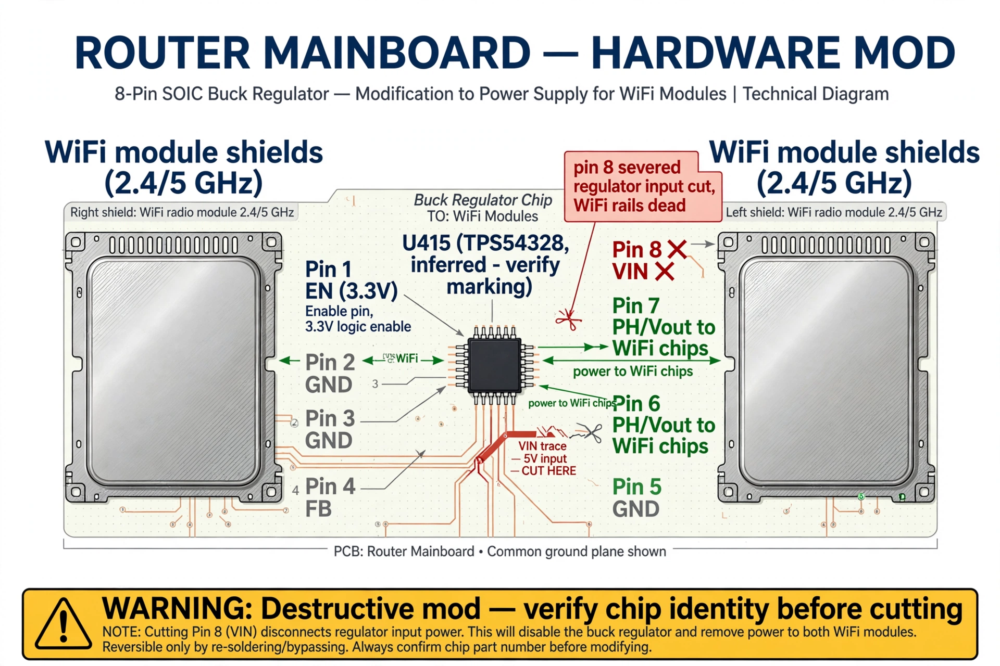
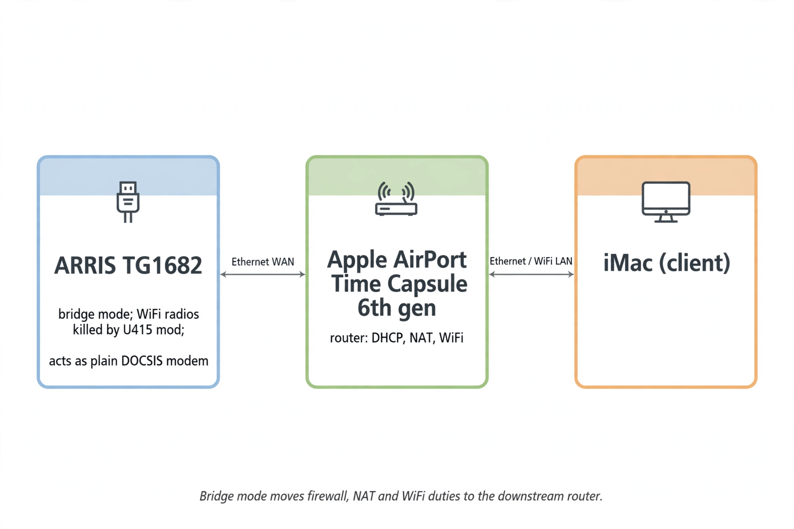

# U415 Pin-8 Mod — Kill the WiFi Radios

> ⚠️ **Warning: destructive, irreversible hardware modification.** Severing a pin
> permanently alters the board, voids any warranty, and can destroy the PCB or
> neighboring components if the tool slips. This documents what was done and why;
> it is not a recommendation. The reversible alternative (grounding the EN pin)
> is described below.

## Purpose

Even in bridge mode, the TG1682 broadcasts hidden SSIDs with no software option
to disable the radios. The goal: kill the 2.4/5 GHz radios at the hardware
level so an Apple AirPort Time Capsule (6th gen) can serve as the sole router
behind the gateway in bridge mode.

## Background

Public reference: pmarks-net's "Xfinity XB3 hardware mod: Disable WiFi and save
2 watts" (https://gist.github.com/pmarks-net/af40dba69272806c1ec9cbe71429d2e7).
Summary of that work: between the two shielded WiFi modules sits an 8-pin chip
marked "54328" — a TI TPS54328 buck regulator. Its switch-node pins feed both
Atheros WiFi chips; pin 1 (EN, 3.3 V) is the regulator enable. Grounding EN
disables the regulator and the radios (measured: 14.9 W → 12.5 W idle).

The chip at reference designator **U415** on this board is consistent with that
regulator (8-pin package between the WiFi shields). **TODO: verify** the U415
marking against the board before assuming identity.

## What was done

*Illustrative — "5V input" annotation unverified; chip identity inferred.
See REVIEW.md.*

1. Opened the enclosure (6 screws, 2 hidden; plastic prying).
2. Located U415 (8-pin chip between the WiFi module shields).
3. **Severed pin 8** of U415 using iFixit tweezers (no soldering iron available).
4. Reassembled and powered on.

If U415 is the TPS54328 in the 8-pin package, the standard pinout is
1=EN, 2=SS, 3=RT/CLK, 4=COMP, 5=GND, 6=PH, 7=PH, **8=VIN** — i.e. severing pin 8
cuts the regulator's input power, starving the WiFi rails. **Pin-8 = VIN is
inferred from the package pinout, not measured on this board — TODO: verify.**

## Observed result

- 2.4 GHz and 5 GHz LEDs: **off** — radios dead.
- Wired Ethernet: unaffected.
- Gateway otherwise functional; bridge mode usable with the AirPort as router.

## Notes and caveats

- Unlike the gist author's reversible mod (ground EN), a severed pin cannot be
  undone without micro-soldering.
- The gist author notes they never identified what pulls the EN pin up; loading
  an unknown digital output is a (small, measured) risk. Severing VIN sidesteps
  that concern but is cruder.
- Bridge mode shifts all firewall/NAT/WiFi duties to the downstream router —
  the TG1682's own security settings become inert while bridged.

## Reversible alternative (not performed)

Ground pin 1 (EN) of the regulator to a nearby ground point (e.g. the far side
of a nearby capacitor). Per the reference mod, the EN pin sinks negligible
current to ground. Lift the pin first if you have the tools; the reference
author did not.
