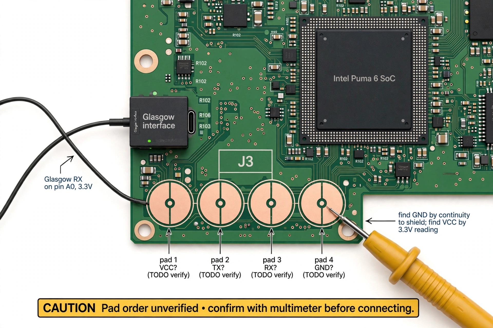
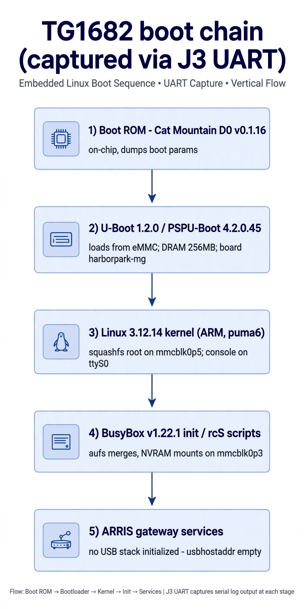

# J3 UART Boot Log

## Capture setup

- Target: J3, 4-pin unpopulated pad cluster near the SoC (pads drilled out for access).
- Probe: Glasgow Digital Interface Explorer, `uart` applet.
- Command: `glasgow run uart -V 3.3 -a --rx A0 tty`
- Logic level: 3.3 V. RX on Glasgow pin A0 (target TX → Glasgow RX).



*Illustrative pad layout — pad order is unverified. Identify GND by continuity
to a shield/ground point and VCC by a 3.3 V reading before connecting.*

## Pinout (unverified order — TODO)

| Guess | Basis |
|---|---|
| VCC (3.3 V) | Standard for this SoC's UART |
| TX (target → probe) | Carried the boot log to Glasgow RX |
| RX (probe → target) | Not exercised in this capture |
| GND | Continuity to shield |

Confirm with a multimeter before wiring TX/RX; swapping TX/RX is harmless, but
5 V into a 3.3 V pin is not.

## Capture notes

- Initial baud mismatch: Glasgow auto-adjusted ("switched to 9605 baud" per the
  applet log); expect frame/parity errors until the rate locks. Console baud is
  115200 nominal.
- Capture is read-only: only RX was connected.

## Annotated boot log



```
NPCPU Only Mode = 0
Cat Mountain D0 - Boot Ram.
Version: 0.1.16 (Apr 10 2014, 18:52:35)      <- Puma 6 boot ROM ("Cat Mountain")
Boot Param memory dump: [0x1FFC] - 0x00010016 ...
Load U-Boot from eMMC/NAND Flash
eMMC/NAND copy from 0x00240000 to 0x71FB0000 (len:262144).

U-Boot 1.2.0 (Oct  1 2015 - 13:35:40)
PSPU-Boot 4.2.0.45
DRAM:  256 MB
MMC:   sdhci_puma6: 0
  Manufacturer ID: 0 / Name: MMC256 / Capacity: 231.3 MB
In:    serial / Out: serial / Err: serial
Board-Type:  harborpark-mg
Boot Device: mmc / ACTIMAGE: 1  -> boots UBFI1 @0x002A0000

Starting kernel ...
Linux version 3.12.14 (...) #1 PREEMPT Fri Jul 24 20:49:10 UTC 2020
CPU: ARMv6-compatible processor [410fb764] revision 4 (ARMv7)
Machine: puma6
Kernel command line: root=/dev/mmcblk0p5 rootwait ro nvram=/dev/mmcblk0p3
  fs1=/dev/mmcblk0p7 ethaddr0= usbhostaddr= boardtype=0x00000002 ...
console [ttyS0] enabled
...
VFS: Mounted root (squashfs filesystem) readonly on device 179:5.
init started: BusyBox v1.22.1 (2020-07-24 20:53:11 UTC)
starting pid 66, tty '/dev/ttyS0': '/etc/init.d/rcS > /dev/console 2> /dev/console'
...
P-UNIT : FW version is [ 1.1.8 ]
```

### Key observations

1. **No USB stack.** The entire kernel boot contains no `ehci`/`ohci`/USB-core
   messages. `usbhostaddr=` is an empty cmdline placeholder. The USB host
   function is disabled or not compiled in — corroborates
   `usb-ports-analysis.md`.
2. **eMMC layout.** `mmcblk0p5` = root (squashfs, read-only), `mmcblk0p3` =
   NVRAM (ext3, showed a recoverable journal error on one boot), `mmcblk0p7` =
   secondary FS. Boot partitions `mmcblk0boot0/1` (1 MiB each).
3. **A shell runs on this UART.** Later init lines start
   `/bin/sh --login /etc/scripts/start_cli.sh` on `/dev/ttyS0` — the console is
   interactive post-boot (not exercised here; RX was the only line connected
   plus this capture ended at init).
4. **Firmware vintage.** Kernel and BusyBox both built 2020-07-24; U-Boot from
   2015; Boot ROM from 2014. AEP driver reports "Disabled".
5. **PUNIT firmware 1.1.8**, last reset reason `RESET_COLD_RESET` via
   `RESET_ORIGIN_DOCSIS_WATCHDOG` — i.e. the capture started from a watchdog
   reset, consistent with power-cycling the board to catch the boot.

## Reproducing

1. Open the enclosure, locate the J3 4-pin pads near the SoC.
2. Clean/drill pads if filled; solder or pogo-pin to them.
3. Multimeter: find GND (continuity to coax shield), find 3.3 V (VCC).
4. Connect target TX → probe RX; start with `glasgow run uart -V 3.3 -a --rx <pin> tty`
   (or any 3.3 V USB-TTL adapter at 115200 8N1).
5. Power-cycle the gateway to catch the Boot ROM banner.
