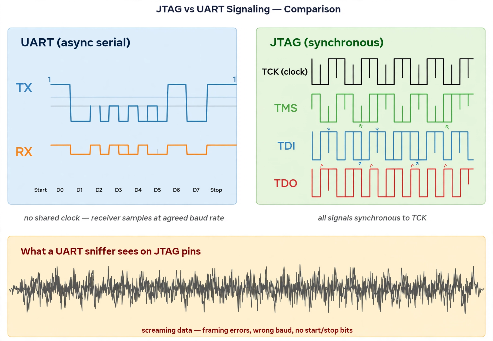

# J1/J2 USB-A Ports — Documentation Dragnet

Target: the two USB-A ports on the ARRIS TG1682 mainboard, silkscreened J1/J2.

## What official documentation says

| Source | Claim |
|---|---|
| ARRIS user manual | "Two USB host ports (future support for external USB devices)" |
| ARRIS datasheet (TG1682G) | USB 2.0 host port "for connecting external storage or other devices" |
| FCC filings | Schematics/block diagrams withheld as confidential trade secret |
| Community reports | Ports present but non-functional for storage/networking; power only |

Hardware implementation per public sources: the ports tie to the Intel Puma
DHCE2652 SoC's integrated USB 2.0 controller. No separate USB controller IC.

## What the captured evidence shows

The J3 UART boot log (see `uart-bootlog.md`) contains **zero** USB stack
initialization: no `ehci`/`ohci`, no USB core, no device enumeration. The only
USB-related string in the entire boot is an empty kernel cmdline placeholder:

```
Kernel command line: ... usbhostaddr= ...
```

Conclusion: on this firmware, the USB host function is disabled or not compiled
in. The ports supply power and nothing else.

## The JTAG hypothesis (unverified)



Working hypothesis: J1/J2 are engineering debug interfaces, plausibly JTAG
rather than USB/UART. Basis:

- The ports are physically present but firmware-dead for USB — consistent with
  manufacturing/diagnostic use rather than consumer use.
- UART-sniffing the port pins produced unintelligible high-speed signaling
  ("screaming data") rather than async serial — consistent with probing a
  synchronous protocol (e.g. JTAG TCK/TMS/TDI/TDO) with the wrong tool.
- No successful JTAG session was established in this project; the hypothesis
  was never proven.

What was **not** found: no public TG1682 schematic, no confirmed JTAG pinout
for J1/J2, no successful boundary-scan or OpenOCD session.

## Tested-and-rejected approaches

1. **Apple proprietary debug pinout** (undocumented Apple Silicon debug
   controller configs) — rejected: the TG1682 has no Apple debug controller;
   its ports are plain USB 2.0 electrically.
2. **UART-over-micro-USB config** (repurposing a micro-USB connector as a UART
   carrier, per an X/Twitter post) — rejected: only valid when the target
   device's USB port is itself wired to a UART. The TG1682's USB-A ports are
   USB-compliant host ports at the PHY level.
3. **USB-to-TTL serial adapter to a PC** — rejected: the gateway never
   enumerates as a USB device, so no `/dev/cu.usbserial` appears.

## Planned next step (not executed)

- eLabGuys dual male USB-A breakout board for physical pin access, with a
  Macraigor usb2Demon (or compatible JTAG probe) as the probe.
- Then: identify TCK/TMS/TDI/TDO with a multimeter/scope and attempt an
  OpenOCD session.

## Verdict

| Claim | Status |
|---|---|
| Ports are USB 2.0 host in hardware | Supported by docs |
| USB function works in stock firmware | **Disproven** (no USB init in boot log) |
| Ports are debug interfaces | Plausible, unproven |
| Ports are specifically JTAG | Hypothesis only — **TODO: verify** |
| Ports are UART consoles | **Disproven** (J3 is the UART; see correction in REVIEW.md) |
